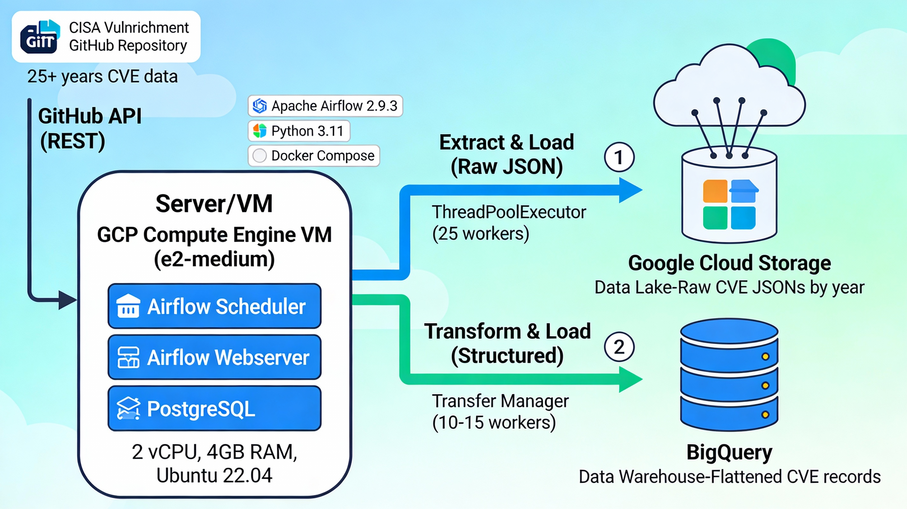

# __CISA CVE Vulnrichment ETL Data pipeline__

## __Overview__
This project implements a production-grade ETL (Extract, Transform, Load) pipeline using Apache Airflow to process Common Vulnerabilities and Exposures (CVE) data enriched by CISA's Authorized Data Publisher (ADP) Vulnrichment program (https://github.com/cisagov/vulnrichment/). 

The pipeline handles 120,000+ raw JSON vulnerability records, transforms them into structured formats, and stores them in a data lake for storage and data warehouse architecture.

--- 

## __Project Architecture__

### _System Components_
The pipeline operates on a GCP Compute Engine VM (e2-medium) with 2 vCPUs, 4GB RAM running Ubuntu 22.04, and consists of three primary layers:
- _Orchestration Layer_: Apache Airflow 2.9.3 with scheduler and webserver for workflow management
- _Data Storage_: PostgreSQL database for Airflow metadata
- _Runtime_: Python 3.11 with Docker Compose for containerization

### _Data Flow_
1. _Stage 1_: __Extract raw cve JSONS into GCS data lake__
- Extracts raw jsons for cve records from CISA Vulnrichment github repository via REST API
- Parallelly extract raw JSONs using ThreadPoolExecutor threads in a two-stage process
- Insert raw JSONs into Google Cloud Storage (GCS) buckets  

 

2. _Stage 2_: __Transform raw data to structured BigQuery table__

## __Technology Stack__

